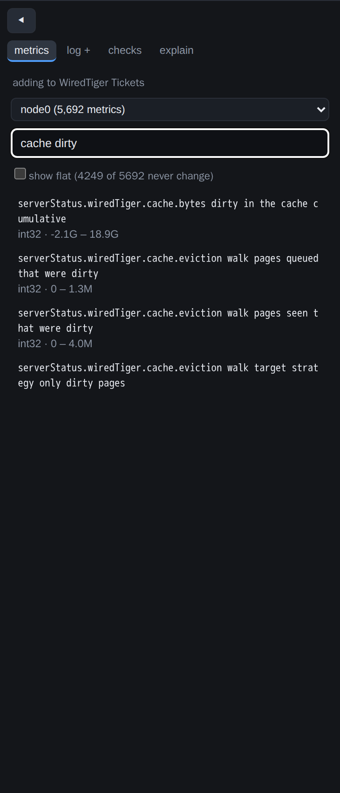
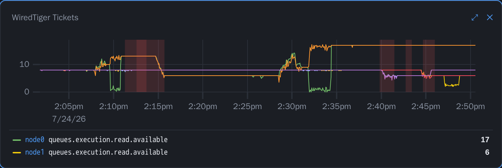
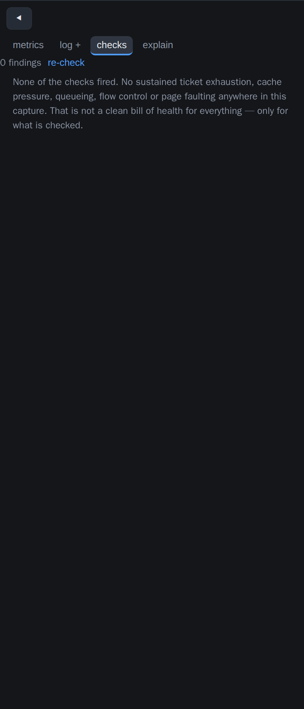
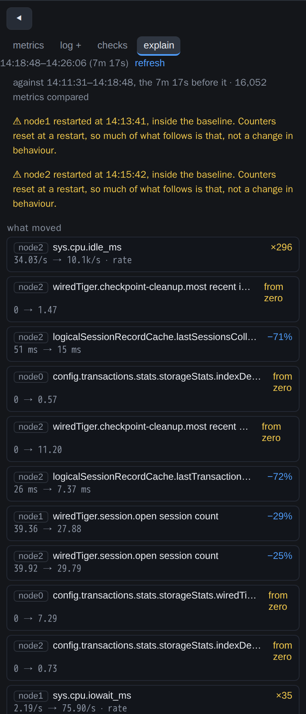

# Big Hole

**Drag a `diagnostic.data` folder into your browser and read every MongoDB FTDC metric —
correlated with the mongod log, across every node of a replica set at once.**

No backend. No containers. No upload. Big Hole decodes FTDC in the browser, stores it on your
own disk, and works with the network cable pulled out. Diagnostic data from a customer's
production cluster never leaves your laptop, and that is enforced by the build, not by a promise
in a README.


---

## What happened to the Docker version

The first Big Hole decoded FTDC with Python and Go and shipped it into a three-container
InfluxDB + Grafana stack. It worked, but every investigation started with `docker-compose build`,
a copy of the metrics files into a fixed directory, and a rebuild whenever you wanted a metric
that was not already in `metrics_to_get.txt`.

This is a rewrite with the same purpose and none of the infrastructure. It is also the fix for
[#3](https://github.com/zelmario/Big-hole/issues/3): FTDC values are 64-bit, InfluxDB's line
protocol is not, and there is no version of "store it in InfluxDB" that does not eventually lose
a WiredTiger timestamp. Big Hole keeps the exact 64-bit values all the way to the chart.

The old version is still there, at the **[`v1-grafana`](https://github.com/zelmario/Big-hole/tree/v1-grafana)**
tag, if you have a workflow built around it.

| | v1 (Grafana) | v2 (this) |
|---|---|---|
| Setup | Docker, docker-compose, 3 containers | `npm install` |
| Metrics available | those listed in `metrics_to_get.txt`, rebuild to add | **all of them**, ~5,700 on 8.0 |
| Nodes at once | one | **every node in the bundle** |
| Logs | separate problem | on the same time axis |
| Data leaves the machine | no | no — and the build fails if any code tries |
| Re-reading yesterday's capture | decode it again | instant, it is already on disk |

## Quick start

Needs [Node.js](https://nodejs.org/) 20 or newer. Nothing else — no Docker, no Go, no Python.

```bash
git clone https://github.com/zelmario/Big-hole.git
cd Big-hole
npm install
npm run dev          # then open http://localhost:5173
```

Drag one of these onto the page:

- a **`diagnostic.data` directory** from a mongod,
- a **support tarball** (`.tar.gz`) — it finds the FTDC and the logs inside, at any depth,
- a **bundle directory with one folder per node** — every member of the replica set loads at
  once, and every chart draws all of them.

Drop a `mongod.log` beside it (or use **+ log**) and the log lines land on the same timeline as
the metrics.

To keep a copy for offline use, `npm run build` produces a static `dist/` you can serve from
anywhere — `npm run preview`, an internal web server, a USB stick. It still never talks to the
network.

## What you get

### Every metric, not a chosen subset

A modern mongod reports around 5,700 metrics per sample. All of them are decoded, all of them
are searchable in the catalogue, and any of them can be dropped onto a panel. Derived
expressions — `rate()`, `pct()`, `div()`, `diff()`, `sum()`, `scale()` — are computed at full
resolution before anything is downsampled, so a rate is exact rather than a rate of averages.



### Every node on the same chart

Panels are written host-agnostically, so dropping in a three-node bundle turns each one into a
three-node comparison with nothing to configure. Cross-host expressions — replication lag, clock
skew — are evaluated per node at full resolution and combined on a shared clock, with a
staleness bound so a node whose capture ended early cannot fabricate a trend.



### The log, on the metric timeline

A support bundle's mongod log is routinely tens of megabytes and can be gigabytes. Big Hole
streams it, keeps a few hundred markers and some `logs.*` series, and reads raw lines from disk
on demand — so the viewer follows the dashboard's window without ever holding the log in memory.
Double-click a line to pin it across every chart; double-click a chart to jump the log there.


### Checks that run themselves

The handful of questions every engineer asks first — did the ticket pool empty, did the cache go
dirty, did the queues build, was flow control engaged — run automatically over the whole capture
the moment it loads. Each finding says what happened, for how long, how many times, and what to
look at next.

They are deliberately conservative: findings are read off the min/max envelope in the direction
that makes them pessimistic, so downsampling can hide a short episode but can never invent one.
A detector that cries wolf gets switched off, and then it catches nothing at all.



### "Explain this window"

The question a finding leaves you with is *what else was different at that moment*. Drag across
a spike and every metric in the capture is ranked by how far it moved compared with the stretch
of time immediately before it, with the log events inside the window listed first. Click a row
and the metric goes onto a panel, so the claim is checked against the curve rather than
believed.



### The things that are easy to miss

- **Gaps and restarts** are detected at ingest and drawn as red bands on every chart. Missing
  FTDC means mongod was down, stalled, or the host froze — one of the strongest signals in a
  capture, and invisible unless something draws it.
- **Renamed metrics resolve anyway.** Tickets moved from `wiredTiger.concurrentTransactions` to
  `queues.execution` in 8.0; the oplog's collStats moved under `storageStats` in 7.0. Panels are
  resolved from what the capture actually contains, never from a version string, because a
  renamed metric produces an empty panel rather than an error.
- **Sharded members work.** A shard reports `common.serverStatus.…` and `shard.serverStatus.…`
  simultaneously; role prefixes are detected from the data and applied per path.
- **Dashboards are yours.** Build one, name it, save it, export it, or share a permalink — which
  carries the layout only, never the data.

## Supported MongoDB versions

Tested against captures generated from real mongod builds, 4.4 through 8.0, plus a sharded
cluster and real customer bundles from 7.0 and 8.0 (Percona Server for MongoDB included). The
guardrail is a test, not a claim: `tests/versions.test.ts` asserts that the metrics an
investigation cannot proceed without — tickets, cache, queues, connections, opcounters, memory,
CPU — resolve on every captured version.

| Capture | Metric paths | Roles | Panels that draw |
|---|---|---|---|
| 4.4 / 5.0 / 6.0 | ~2.1–2.5k | none | 43/44 |
| 7.0 | 2,950 | none | 43/44 |
| 8.0 | 5,616 | none | 43/44 |
| 8.0 sharded | 5,846 | `common`, `shard` | 43/44 |
| real 8.0 sharded, 3 members | 5,763 | `common`, `shard` | **44/44** |

The one panel missing on single-node fixtures is "Replica members ping", which needs a peer to
ping.

## Privacy, as a build gate

The promise is that diagnostic data from a customer's production cluster stays on your machine.
That is worth nothing unless it is checked:

- CI fails the build on `fetch`, `XMLHttpRequest`, `sendBeacon` or `WebSocket` outside an
  explicit allowlist.
- The shipped HTML's CSP permits no external origins. Fonts and wasm are bundled.
- A test loads a capture with the network stubbed to throw.
- Decoded captures live in **OPFS** — the browser's private on-disk storage for this origin,
  which is local disk and not a network surface. `localStorage` holds dashboard layouts only.
- The browser checks assert that a full session — ingest, charts, logs, checks, explain — issues
  no network request at all.

## Speed

Measured on a real 42-hour, 152,308-sample, 5,763-metric customer capture (102 MB on disk),
single core:

| | |
|---|---|
| decode | 197–289M values/s |
| ingest | 13.7 s for 877M values, cold |
| stored | 7,022 MB dense → **1,522 MB** after constant-column elision |
| resident memory once open | **1.95 MB** — the manifest and the sample clock |
| one series at 1200 points | **10 ms** |
| ranking all 5,759 metrics over a window | **48 ms** |

Resident memory is a function of what is on screen, not of capture size: a one-day single-node
capture decodes in about a second, and a three-node replica-set week is handled by streaming
chunks to disk rather than by holding 36 GB in a tab.

## Development

```bash
npm run dev              # Vite dev server
npm test                 # full suite, including full-matrix decoder equality
npm run build            # typecheck + production build
```

Verification tools, all of which take real captures:

```bash
npm run inspect  -- <dir>          # cadence, gaps, roles, throughput, elision, coverage
npm run coverage -- <dir>          # which dashboard panels this capture cannot draw, and why
npm run checks   -- <dir>          # run every pathology rule and print what fired
npm run explain  -- <dir> [from to]  # rank what moved in a window
npm run verify:multi [bundle]      # drive the real app in a real Chromium
npm run verify:explain [bundle]
npm run verify:logpage [bundle]
```

The decoder is verified against MongoDB's own implementation rather than against itself:
`tools/oracle/` decodes a fixture with `github.com/mongodb/ftdc` and emits JSONL, and the test
suite compares **every metric of every sample** — millions of values per fixture — plus column
order at each schema boundary. FTDC has several failure modes that are completely silent (a BSON
`Timestamp` produces two columns, and a zero-run counter carries across column boundaries), so
spot-checks are not an acceptable substitute.

```bash
npm run oracle:build       # builds the Go reference (needs Docker)
npm run fixtures           # captures fixtures from a local mongod
npm run fixtures:versions  # the 4.4 → 8.0 matrix
npm run fixtures:sharded   # a sharded cluster, the only way to reproduce role scoping
```

`docs/ftdc-format.md` is the byte-level format spec, verified against the reference
implementation with line citations. `ARCHITECTURE.md` and `PLAN.md` describe the architecture and why
each decision was made — including the ones that were wrong first.

## Credits

- The original Big Hole was built after using **[Keyhole](https://github.com/simagix/keyhole)**
  by Ken Chen (@simagix), and exists because sometimes you need a metric it does not show.
- **[github.com/mongodb/ftdc](https://github.com/mongodb/ftdc)** is the reference implementation
  the decoder is verified against.
- The starting dashboard is ported from
  **[devops-land/mongodb_ftdc_viewer](https://github.com/devops-land/mongodb_ftdc_viewer)**.

## License

MIT — see [LICENSE](LICENSE).
