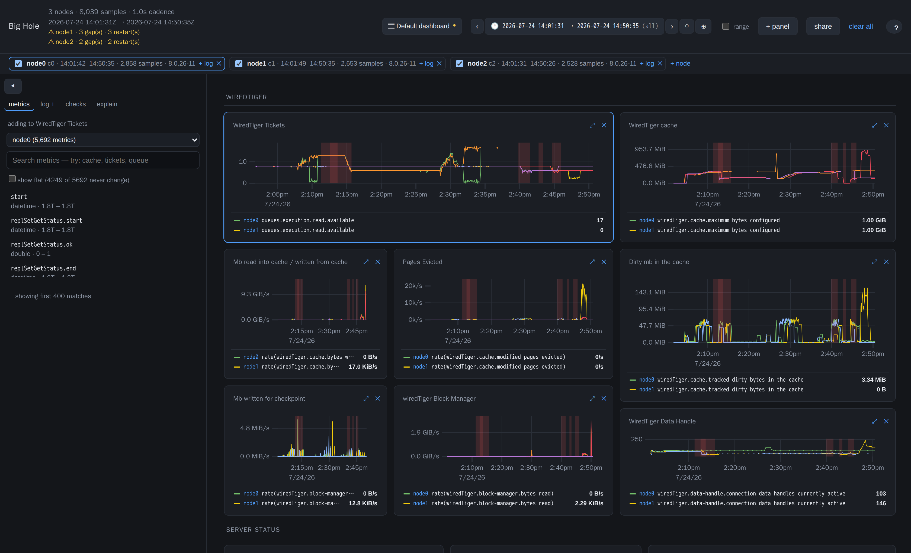
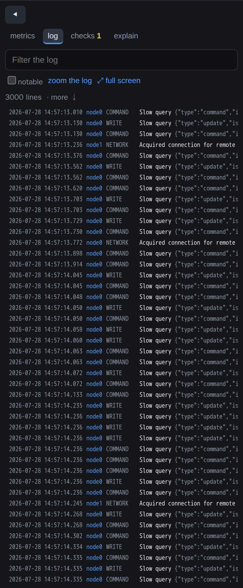

# Big Hole

**Read MongoDB FTDC in your browser.** Drag a `diagnostic.data` folder — or the whole support
tarball — onto the page and you get every metric, every node, and the mongod log on one time
axis. No Docker, no InfluxDB, no upload. Your data stays on your laptop.



## Get it running

You need [Node.js](https://nodejs.org/) 20 or newer. That's the only prerequisite.

```bash
git clone https://github.com/zelmario/Big-hole.git
cd Big-hole
npm install
npm run dev
```

Open http://localhost:5173 and drag in one of these:

- a **`diagnostic.data` folder** from a mongod,
- a **support tarball** — it finds the FTDC and the logs inside, however they're nested,
- a **folder with one subfolder per node** — the whole replica set opens at once.

Drop a `mongod.log` in beside it (or use **+ log**) and the log lines land on the same timeline as
the metrics.

That's it. Decoding happens on your machine, once — reopening a capture you looked at yesterday is
instant.

## What you can do with it

**Look at any metric, not a chosen few.** A modern mongod reports around 5,700 metrics per sample
and all of them are here. Search the catalogue, click one, and it's on a chart. Need a rate, a
percentage or a difference? Wrap it: `rate(serverStatus.opcounters.query)`,
`pct(cache.dirty, cache.max)`, `diff(nodeA.lastWrite, nodeB.lastWrite)`.

**See the whole replica set at once.** Drop in a three-node bundle and every panel becomes a
three-node comparison — no configuration. Replication lag and clock skew panels appear on their
own once a second node is loaded.

**Zoom once, everywhere.** Drag across any chart and every panel follows, including the log.

**Read the log next to the metrics.** The log viewer follows the dashboard's window, so zooming
into an incident narrows the log to the same minutes. Notable lines — elections, sync-source
changes, restarts — are highlighted. Double-click one to pin a marker across every chart;
double-click a chart to jump the log to that instant. There's a full-screen `less`-style view for
reading long slow-query documents.



**Let it check the obvious things for you.** The moment a capture loads, Big Hole runs the checks
you'd run first anyway — did the ticket pool empty, did the cache go dirty, did the queues build,
was flow control engaged, was the host page-faulting. Each finding says what happened, for how
long, how bad it got, and what to look at next. Click one and the dashboard zooms to it. An empty
list is an answer too.

**Ask "what else happened here?"** Brush a spike, open the **explain** tab, and every metric in
the capture is ranked by how much it moved compared with the minutes just before — with any log
events from that window listed on top. Click a row and the metric goes onto a chart so you can
check it yourself.

**Keep the view.** Build a dashboard, name it, save it, and it's there next time. Share it with
the **share** button: the link carries the layout, never the data, so a colleague opens it against
their own copy of the capture.

## It works with the version you were sent

Tested on captures from MongoDB and Percona Server for MongoDB **4.4 through 8.0**, including
sharded clusters, where metrics move around between releases:

- tickets left `wiredTiger.concurrentTransactions` for `queues.execution` in 8.0,
- the oplog's stats moved under `storageStats` in 7.0,
- a shard member prefixes half its metrics with `shard.` and the other half with `common.`.

Big Hole resolves all of that from what your capture actually contains, never from a version
number — so a panel keeps working on a release nobody tested it against. On a real 3-node 8.0
sharded bundle, all 44 dashboard panels draw.

## Your data does not leave your machine

This matters when the capture came from someone else's production cluster:

- **Nothing is uploaded, ever.** The app works with your network cable unplugged.
- Captures are stored by your browser on your own disk, private to the page, and you can delete
  them from the capture bar.
- Shared links carry the dashboard layout only — never a single data point.
- It's not just a promise: the build fails if any code introduces a network call, and the tests
  load a capture with the network stubbed to throw.

## How fast

A 42-hour capture with 152,308 samples and 5,763 metrics — 102 MB of FTDC:

- opens in about **14 seconds** the first time, instantly after that,
- uses about **2 MB** of memory while you browse it, because only what's on screen is loaded,
- draws a chart in **10 ms**, and ranks all 5,759 metrics over a window in **48 ms**.

A single-node day decodes in about a second.

## If something looks wrong

- **A panel is empty.** That metric isn't in this capture — usually a version difference. Run
  `npm run coverage -- <your diagnostic.data>` and it will name the missing paths and suggest
  near-misses from your capture's own catalogue.
- **A red band across the charts.** That's a gap: FTDC stopped being written there, which usually
  means mongod was down, stalled, or the host froze. It's a finding, not a rendering bug.
- **The log looks empty.** Check the time range — the viewer only shows the window you're zoomed
  into.

## For the curious

- `ARCHITECTURE.md` — how it works and why each decision was made, including the ones that were
  wrong first: the four ways an FTDC decoder is silently incorrect, why the decoded data lives on
  disk instead of in memory, and why the downsampler draws a min/max envelope rather than a
  prettier curve.
- `docs/ftdc-format.md` — the byte-level format, verified against
  [`github.com/mongodb/ftdc`](https://github.com/mongodb/ftdc) with line citations.

A few command-line helpers, if you'd rather not open a browser:

```bash
npm run inspect  -- <dir>            # what's in this capture: cadence, gaps, roles, coverage
npm run checks   -- <dir>            # run the checks and print what fired
npm run explain  -- <dir> [from to]  # rank what moved in a window
npm test                             # the full suite, including decoder equality tests
npm run build                        # a static build you can serve anywhere, or carry on a stick
```

## Credits

Built after years of using **[Keyhole](https://github.com/simagix/keyhole)** by Ken Chen
(@simagix), and because sometimes you need the metric it doesn't show.
**[github.com/mongodb/ftdc](https://github.com/mongodb/ftdc)** is the reference implementation
this decoder is checked against, value for value.

The previous version of Big Hole — the one that decoded FTDC into InfluxDB and drew it in
Grafana — is still available at the
[`v1-grafana`](https://github.com/zelmario/Big-hole/tree/v1-grafana) tag.

## Author

**Zelmar Michelini** — [LinkedIn](https://uy.linkedin.com/in/zelmario) ·
[github.com/zelmario](https://github.com/zelmario) ·
[zelmar@michelini.com.uy](mailto:zelmar@michelini.com.uy)

Found a capture it reads wrongly, or a metric it cannot resolve? That is the most useful thing
you can send me — with the mongod version and, if you can share it, the capture.

## License

MIT — see [LICENSE](LICENSE).
